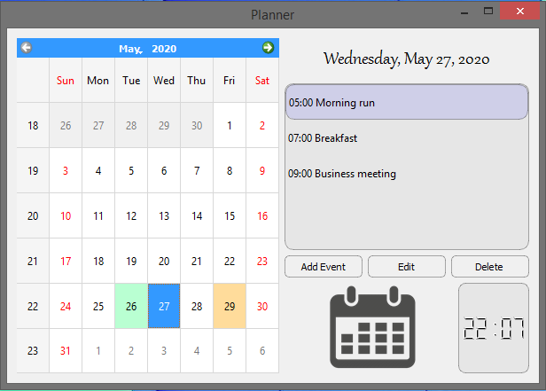
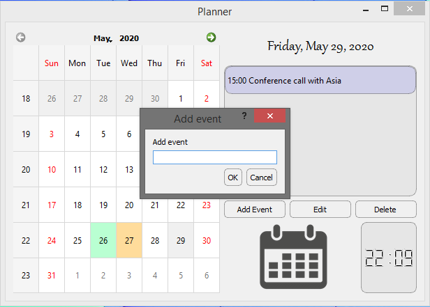

# Planner app with calendar
* made with PyQt5
* saves and loads data from JSON file
* automatically deletes entries from past days
* visually shows which dates have events planned 
* the LCD clock is constantly updated

# Sample screens

#

